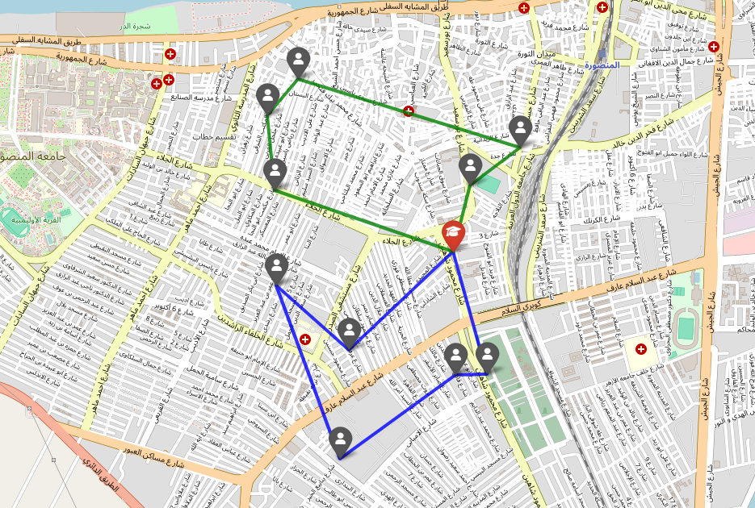

# Smart Bus Route Optimization

An **operations research–based route optimization simulation** developed as part of **SONIC**, a smart transportation system developed for my B.Sc. graduation project in Computer Science (AI program) at Mansoura University.

The notebook formulates student pickup planning as a **Capacitated Vehicle Routing Problem (CVRP)**. It generates reproducible pickup locations around a school in Mansoura, obtains road-network travel durations from OpenRouteService, assigns students to buses without exceeding vehicle capacity, and visualizes the resulting routes with Folium.

## Result

## Technical Approach

| Component | Implementation |
|---|---|
| Input data | Simulated student pickup coordinates |
| Travel costs | OpenRouteService duration matrix |
| Problem formulation | Capacitated Vehicle Routing Problem (CVRP) |
| Solver | Google OR-Tools |
| Visualization | Interactive Folium map |

## Run

1. Open `smart_bus_route_optimization.ipynb`.
2. Run the notebook cells in order.
3. Enter an OpenRouteService API key when prompted.

The API key is entered at runtime and is not stored in the notebook.

## Scope

This project uses generated pickup locations to simulate capacity-aware school bus route planning. It does not incorporate live traffic, time windows, or production fleet operations.
